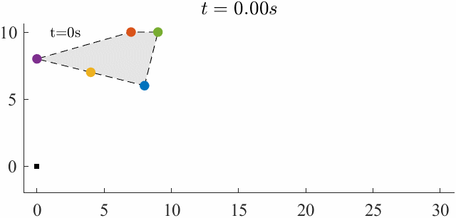
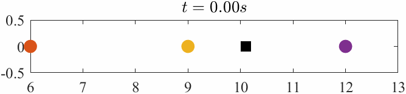
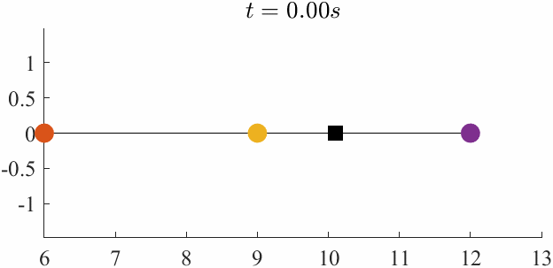

# Singleton-free fencing control of unknown maneuver target

The `gif`-format figures in our paper **Singleton-free fencing control of unknown maneuver target** are presented below.

### Fig. 4

### Fig. 6 (a)

### Fig. 6 (b)

