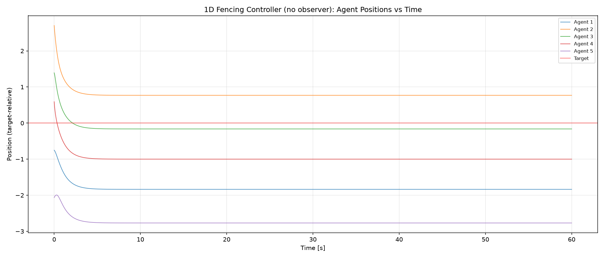
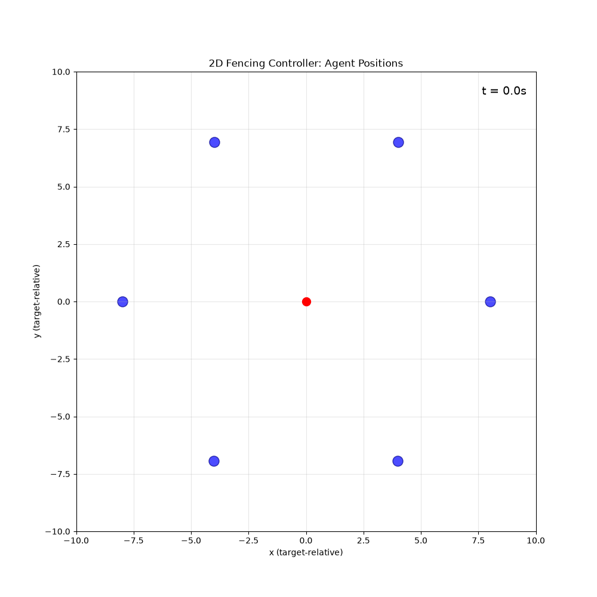
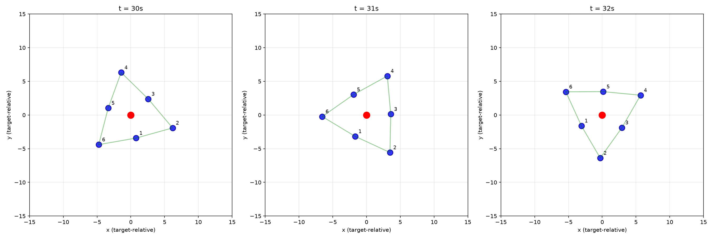
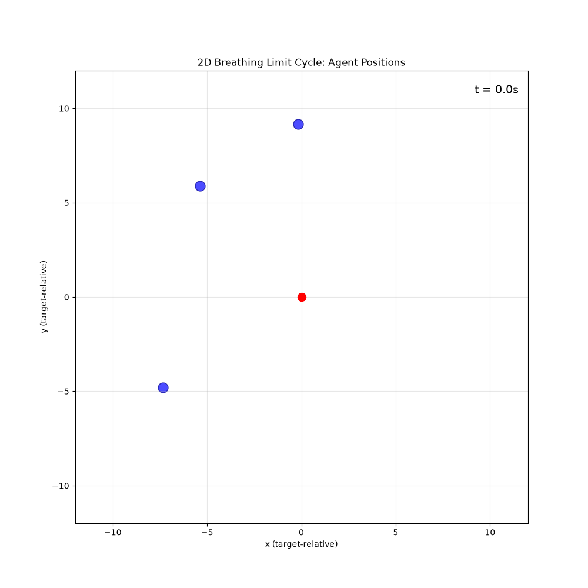
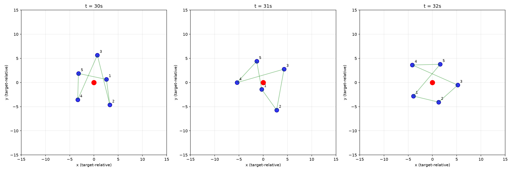
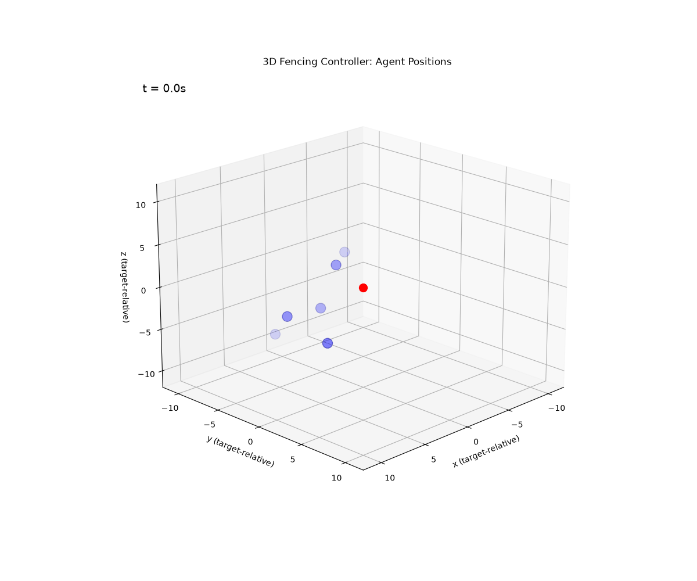

Most existing results on flocking/fencing control achieve the velocity‑matching property, which is typically guaranteed via a Lyapunov function.
However, the first algorithm presented in https://ieeexplore.ieee.org/document/9415150 only guarantees that the average velocity of all agents converges to the target value.
The final formation yielded by this algorithm exhibits several intriguing phenomena, which I suspect may correspond to bifurcations.


## Controller


\begin{aligned}
u_i &= \varphi_i + k_1(x_0 - x_i) + v_i \\
\dot{v}_i &= k_2(x_0 - x_i)
\end{aligned}


Central repulsion $\alpha(s) = 1/(s-d) - 1/(\mu-d)$ for $s \in (d, \mu]$.

## Three regimes

| | 1D | 2D rigid rotation | 2D breathing |
|---|---|---|---|
| **$N$** | 5 | 6 | 5 |
| **$d / \mu$** | $0.5 / 2.0$ | $5.0 / 9.0$ | $5.0 / 9.0$ |
| **$k_1 / k_2$** | $1.0 / -$ | $0.5 / 0.5$ | $0.5 / 0.5$ |
| **$v_0$** | $1.0$ | $(1, 0)$ | $(1, 0)$ |
| **Behavior** | Static equilibrium in target frame | $|\omega| = \sqrt{k_2}$ | $T \approx 2.49\text{s}$, $\omega_\text{eff}/\sqrt{k_2} \approx 3.57$ |

### 1D (no observer)

```
x₀ = [-0.75, 2.70, 1.39, 0.59, -2.06]
```

Vehicles converge to a static formation that fences the target. Velocity error $\to 0$.



### 2D rigid rotation

```
x₀ = regular hexagon, R = 8.0
v₀ = (1, 0)
```

Formation rotates at $|\omega| = \sqrt{k_2} = 0.707$ — matches the theoretical prediction from `fencing_rotation.tex`.



Steady-state snapshots at $t = 30, 31, 32, 33$ s:



### 2D breathing limit cycle

```
x₀ = [[-10.58, -12.53], [-5.38, 5.90], [-0.18, 9.18],
      [-7.35, -4.81], [-6.29, 12.44]]
v₀ = (1, 0)
```

Non-symmetric initial conditions. 
Pairwise distances oscillate periodically — the formation breathes instead of rotating rigidly.



Steady-state snapshots at $t = 30, 31, 32, 33$ s:



### 3D non-planar rotation

```
x₀ = random 3D positions
v₀ = (1, 0, 0)
```

With random 3D initial conditions, vehicles form a genuinely non-planar rotating formation ($\sigma_3/\sigma_1 \approx 0.91$). Planar initial conditions stay planar — confirming the code is correct and the 3D behavior is real.



## Key insight

The controller constrains only the average position error and average velocity, leaving $2(N-1)$ circulation degrees of freedom unconstrained. Different initial conditions excite different attractors: rigid rotation, breathing limit cycle, or 3D non-planar orbits.